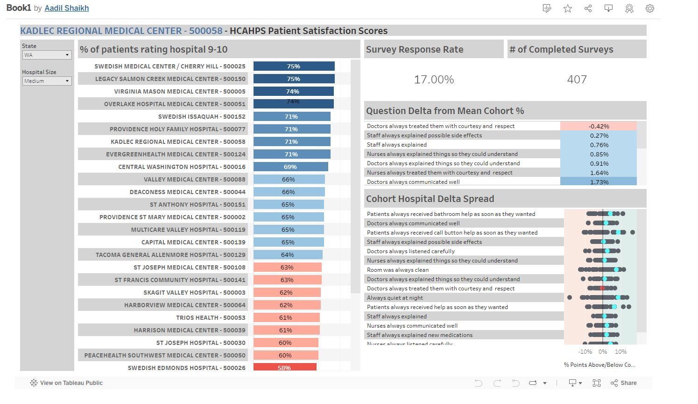

## Executive Summary

*This report provides an analysis of patient satisfaction data from the CMS HCAHPS 2022 survey, visualized through an interactive Tableau dashboard. The dashboard evaluates hospital performance across the United States, presenting metrics related to overall hospital experience, communication with healthcare providers, and survey response rates.*

*The primary objective of this dashboard is to enable data-driven decision-making, support benchmarking against peers, and identify actionable opportunities for improvement. Developed with alignment to the Canadian Institute for Health Information (CIHI) standards, it offers a valuable tool for healthcare administrators and policymakers to enhance patient care quality and satisfaction.*

Here is visualization from the dashboard:



## Analysis Overview

### Data Source and Structure

- **Dataset:** [CMS HCAHPS 2022 Patient Survey](https://data.cms.gov/provider-data/search?fulltext=survey&theme=Hospitals)
- **Scope:** Covers patient satisfaction feedback across all 50 U.S. states and hospital sizes.
- **Survey Purpose:** Captures patient-reported experiences during hospital stays, focusing on critical aspects such as communication, responsiveness, and cleanliness.

### Survey Structure

Utilizes "Top Box" responses, representing the highest satisfaction levels (e.g., "Always" or "9–10").

### Filters and Interactive Features

- **State Filter:** Enables state-specific analysis for regional insights.
- **Hospital Size Filter:** Groups hospitals into three categories:
  - Large: >500 beds
  - Medium: 100–500 beds
  - Small: <100 beds

### Metrics Calculated in Tableau

#### Top Box Filter

Identifies responses rated as "Always" or "9–10," emphasizing high satisfaction levels.

**Tableau Calculation:**

```text
IF CONTAINS([HCAHPS Question], 'Always') OR CONTAINS([HCAHPS Question], '9') THEN 1 ELSE 0 END
```

#### Cohort Delta Spread from Mean

Measures a hospital’s performance deviation from the cohort average based on state and hospital size.

**Level of Detail Tableau Calculation:**

```text
[Actual HCAHPS Answer Percent] - 
{FIXED [State], [Hospital Size], [HCAHPS Answer Description]: AVG([Actual HCAHPS Answer Percent])}
```

## Key Visualizations in the Dashboard

1. **Overall Hospital Experience (Top Box Ratings)**
   - **Purpose:** Evaluates the percentage of patients rating hospitals 9–10 on a 10-point scale.
   - **Use Case:** Assists hospital administrators in identifying high-performing institutions and benchmarking against similar-sized hospitals within the same state.

2. **Question Delta from Mean Cohort**
   - **Purpose:** Highlights performance deviations in specific satisfaction areas, such as communication and responsiveness.
   - **Use Case:** Allows hospitals to pinpoint improvement opportunities by comparing their metrics against the average for their state and size cohort.

3. **Cohort Hospital Delta Spread**
   - **Purpose:** Visualizes hospital performance relative to the cohort average, categorizing outcomes into positive (above average) or negative (below average) zones.
   - **Use Case:** Empowers decision-makers to identify strengths and weaknesses at a granular level, facilitating targeted interventions.

4. **Survey Response Rate and Number of Completed Surveys**
   - **Purpose:** Demonstrates the reliability and representativeness of survey data, ensuring insights are based on robust sample sizes.

## Alignment with CIHI Indicators

The dashboard integrates key principles of CIHI’s Patient-Reported Experience Measures (PREMs), focusing on:

- **Patient-Centered Outcomes:** Evaluating overall satisfaction with hospital services.
- **Quality of Communication:** Measuring interactions with nurses and doctors through Top Box metrics.
- **Actionable Benchmarks:** Providing comparative insights to foster continuous improvement in patient care delivery.

## Recommendations and Applications
- Utilize the dashboard’s state and hospital size filters to identify leaders and laggards in patient satisfaction.
- Benchmark performance across comparable institutions to drive informed decision-making.
- Identify high-performing hospitals and study their practices to share knowledge across the healthcare system.
- Use insights from the Cohort Delta Spread to prioritize resource allocation and interventions in underperforming areas.
- Leverage survey response rate data to ensure data-driven strategies are based on reliable and representative samples.

## Conclusion

This Tableau dashboard provides a comprehensive yet flexible tool for analyzing patient satisfaction data across U.S. hospitals. By aligning with CIHI standards, it ensures relevance and applicability for healthcare administrators aiming to benchmark performance and improve care quality. Through the dashboard’s interactive features and calculated metrics, hospitals can target specific areas for improvement, benchmark effectively, and implement strategies to enhance patient experience.
```
